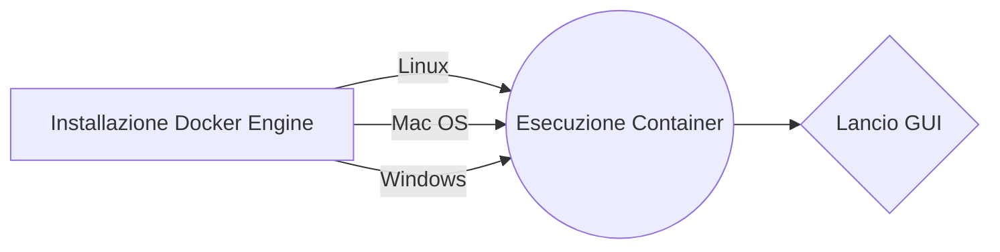

# EM SSL Decoder

## Suite di visualizzazione/info chiavi SSL/TLS)



<details>
<summary>Installazione Docker Engine</summary>

##### Installare la versione corretta del Docker Engine in base alla piattaforma desiderata.

##### Fare riferimento al sito [www.docker.com](https://www.docker.com/) alla sezione download</sub>

</details>

<details>
<summary>Esecuzione Container</summary>

##### Aprire una shell (Linux/Unix/Mac) oppure il CMD (Windows) ed avviare il Container Docker

```shell
   docker run -d --restart unless-stopped --name EM_SSL_Decoder --hostname em_ssl_decoder -p 4000:4000 linhosan/em-ssl-decoder
```

##### Di default verrà eseguita l'ultima versione disponibilie (latest), altrimenti è possibile specificare una versione di immagine specifica. Per convenzione le versioni precedenti vengono esposte sulla porta 4001 e non sulla 4000.

```shell
   docker run -d --restart unless-stopped --name EM_SSL_Decoder_Old --hostname em_ssl_decoder_old -p 4001:4000 linhosan/em-ssl-decoder:emssldec_v1.09
```

</details>

<details>
<summary>Lancio GUI</summary>

##### Navigare tramite browser sulla nuova istanza locale [EM SSL Decoder](http://localhost:4000/)

</details>